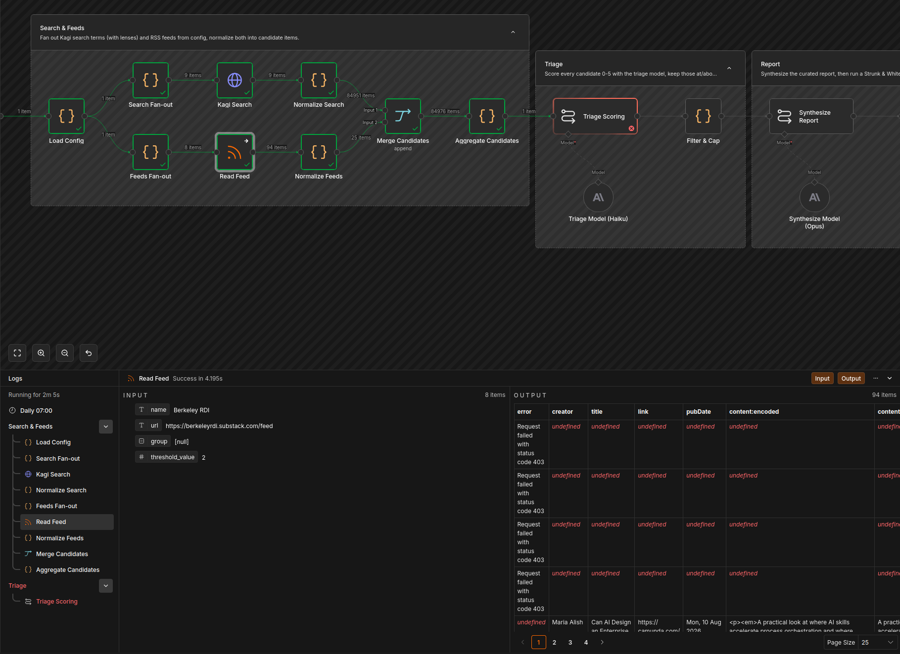

# Instructions to the n8n AI 
## Purpose
A research agent that runs daily, researching topics related to our core business, and providing a curated report on a daily basis. Breaking important news, events and speaking opportunities, popular blog posts should be surfaced.  
A configuration file will be provided with details on terms to search for and what RSS feeds to pull from. 

## Search Engine
Kagi should be used for search.  The results of this search should be sent to 
Take advantage of Kagi's lens feature, and recommend lens settings on an ongoing basis.  Len settings are provided in the 
configuration..

## Constraints
1. For any final reports back to the user, assure that the content is run through a copy edit pass with instructions to apply Struct and White Elements of Style 
1. Include the time each Reference was published.

## Thoughs about aticle
Focus:  converting previous python based application that builds a feed - an alternative to Social Media - that builds a feed just for me.  
Hook:  AI is mostly making the internet worse, how can we apply AI in ways to improve our shared community and our access to high value information.  
Character: There is an emerging class of "Citizen Developers" that are not afraid of technology but are also not trained software engineers.  These are attorneys, analysts, researches, and logistics experts.   
Conflict:  There are several things playing against our Citizen Developers - 
Conclusion: N8N is good in certain circumstances.  If you want to build your own agents,  N8N is a useful way for citizen developers to do so if they are working in isolation and can remain the primary experts.  It can build technical expertiese and removes some major barriers of entry.
Next week we will look at SpiffWorks, the software my company created.   

Are you arguing with puppets on social media, reading artificial blog posts, doom-scrolling AI noise?  Cut the strings.  Follow along as we apply technology to reduce noise and reconnect with real human beings.  

he internet is becoming a puppet show run by algorithms, and the audience is losing interest. The Primitive Puppet Show is about cutting the strings: applying AI to rebuild community and restore access to information that actually matters.

* Feels a bit like training wheels. I know the cool things I can do on this bike, and while the wheels definitely stablize me in certain ways, I am slower here and I feel like less options are avialble to me. This is inevitable in a tool like this.  In the case of n8n, the audience is people who are technical, but didn't go through formal software engineering courses - or have not been, and do not intend to get good a writing and organizgin software in the traditional way.
* 

## Observations for next article
12. n8n is single-user.  Only one person can be editing the diagram at a time.
3. The view of data during execution is very good.  It allows you to rapidly click through each step in the process and see the result.  It separates the input and output of each step, which makes it a little easier to parse.    
5. The tool is very technical.  I (a software engineer by trade) found it a little difficult to use, compared to writing the python applicaiton - but that's because it's a pardaigm shift. The visualization is valuable.  The ability to create groups of processes and sub-workflows
6. The ability to look back at past executions and see the ata at that time is helpful.
9. Generally works from the premise of automated systems not human interactions, but it has basic support for forms and for approvals (these are two seperate types of tasks).  This is connected to a finite set of existing tools, lie a chat window, discord, gmail, google chat, outlook, teams, slack, telegram.   The response type of is either an approval (where you can add many options), or a open text entry.    
10. They have built a lot of connectors - making it easier to get things working with external systems.  Adding a connector to send messages to slack is in place, and once that is set up, you can handle a lot of interactions with Slack.  It's a lot to choose from, but it makes dealing with disperate systems a lot easier.

## Private observations
1. The UI is nice, and works really well in maximum size on my large display.  It makes good use of space.  Why do I feel that way?
4. The ability to look at data in 3 formats, schema, table, and json is very nice, and allows you to find a way to see the data more easily.
7. The auto-layout of the proces via AI was nice.
8. When adding a new node it will say "No input data" ahd give you the option of automatically executing the previous nodes.  But it doesn't seem to be aware of previous executions and isn't able to just use those.
11. Custom tasks are possible through deployments - so you can make your own connectors if you are self hosting and don't mind writing code in Typescript.
13. n8n allows for production deployments with very high execution rates. Their pricing model is interesting and worth reviewing and keeping track of.
14. Memory across exections - n8n supports data tables that allow you to persis records insdie the platform without talkign to en external datbase**.  I